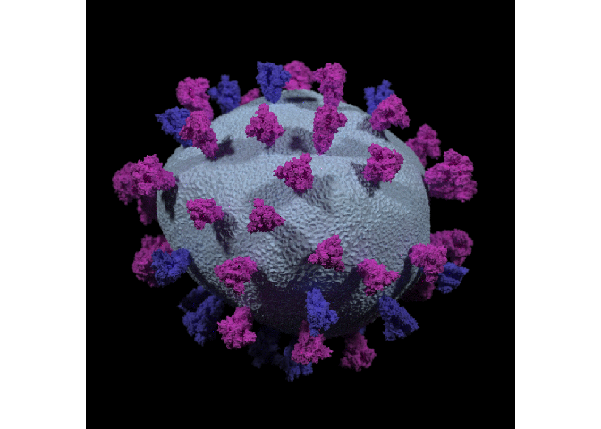
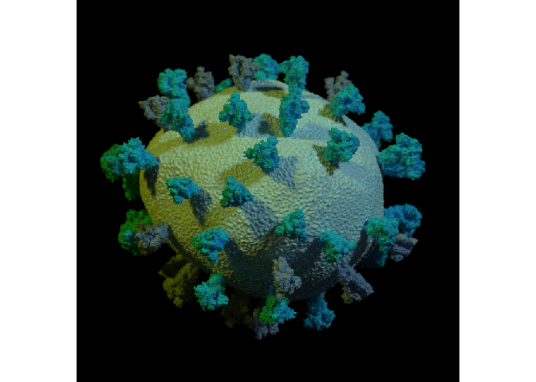
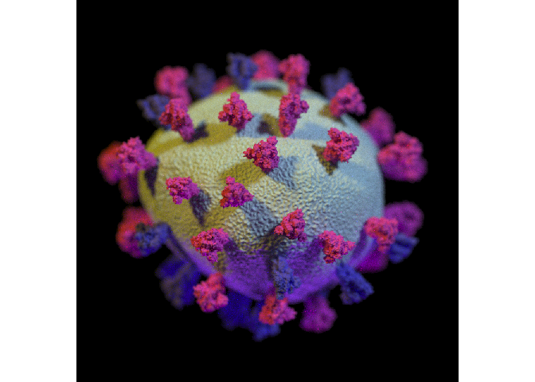
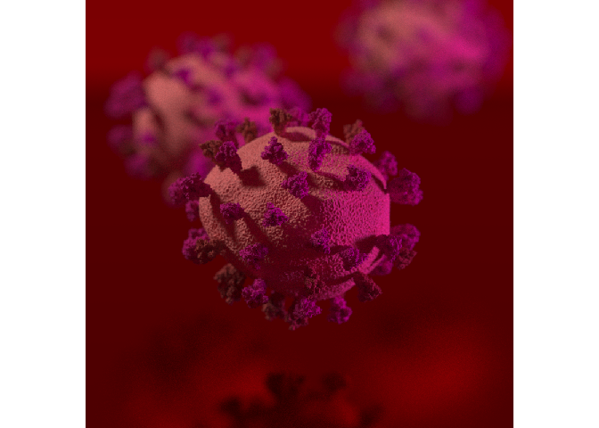

# coronaobj

</img>

The `coronaobj` package is a simple, single-function R package to
generate customized, scientifically accurate 3D models of SARS CoV-2
(the virus that causes the coronavirus disease, COVID-19). The function
`write_corona_obj()` writes out a Wavefront OBJ 3D model with vertex
colors, and the user can specify their own color scheme for the virus.
Specifically, the user can specify a color for the lipid membrane (main
body) of the virus, the closed (inactive) spike protein, and the open
(active) form.

The resulting OBJ file can either be exported and processed in a
external renderer, or rendered directly in R with the
[rayrender](https://www.rayrender.net) package, a pathtracer. The entire package
(model included) is self-contained in the repo, and can be installed
with the `remotes` package.

Description of the 3D model (released with CC SA license) and its
creation (by the National Institute for Allergies and Infectious
Diseases, NIAID), from the NIH 3D Print Exchange
([source](https://3dprint.nih.gov/discover/3dpx-013323)):

> This SARS-CoV2 Virion model was been created based on the latest
> available data in the Protein Data Bank (PDB) and Imaging studies
> conducted by NIAID labs. The orange spikes represent the open, active
> form. The beige spikes represent the close, inactive state."

See the bottom of this README for the full description of the process
NIAID used to create the model.

The 3D model itself is licensed with CC SA. My alterations: I centered
and scaled the model down to fix in a unit box, reduced the floating
point precision to ensure it remained under the 100MB limit to fit in a
single Github repo, and finally cleaned the vertex colors so that there
would only be three unique colors in the model (which enable easy
swapping with colors defined by the user). A image-space distance
criterion was used to choose which color to assign to the few points
which did not fall into the three major assigned colors.

## Installation

You can install `coronaobj` from Github, using the following code.

``` r

install.packages("remotes")
remotes::install_github("tylermorganwall/coronaobj")
```

And if you want to render images of the model directly in R, install the
latest version of the rayrender package as well.

``` r

remotes::install_github("tylermorganwall/rayrender")
```

## Examples

We load the library and use the `write_corona_obj()` function to create
an OBJ file with vertex colors in our directory. We will render it with
rayrender, adding some lights above and to the left and right of the
model.

``` r
library(coronaobj)
library(rayrender)

write_corona_obj("defaults.obj")
#> [1] "defaults.obj"

obj_model("defaults.obj", vertex_colors = TRUE) %>%
  add_object(sphere(y=10,z=10,x=10, material=light(intensity=100))) %>%
  add_object(sphere(y=10,z=10,x=-10, material=light(intensity=100))) %>%
  render_scene(parallel=TRUE, samples = 1000, fov = 7, min_variance=0, focal_distance = 9.6,
               width=800,height=800)
```



We can customize the color by passing in colors as well:

``` r

write_corona_obj("custom_color.obj", color_membrane = "cadetblue1",
                color_spike = "steelblue", color_open_spike = "deepskyblue1")
#> [1] "custom_color.obj"


obj_model("custom_color.obj", vertex_colors = TRUE) %>%
  add_object(sphere(y=10,z=10,x=10, material=light(color="lightblue",intensity=100))) %>%
  add_object(sphere(y=10,z=10,x=-10, material=light(color="orange",intensity=100))) %>%
  render_scene(parallel=TRUE, samples = 1000, fov = 7, min_variance=0, focal_distance = 9.6,
               width=800,height=800)
```



We can also change the lighting and aperture using rayrender:

``` r

write_corona_obj("custom_color2.obj", color_membrane = "#a1cdf0",
                color_spike = "#3432cf", color_open_spike = "#d92bc5")
#> [1] "custom_color2.obj"

obj_model("custom_color2.obj", vertex_colors = TRUE) %>%
  add_object(sphere(y=10,z=10,x=10, material=light(color="lightblue",intensity=160))) %>%
  add_object(sphere(y=10,z=10,x=-10, material=light(color="orange",intensity=160))) %>%
  add_object(sphere(y=-10,z=-5,material=light(color="purple", intensity = 160))) %>%
  render_scene(parallel=TRUE, samples = 1000, fov = 7, min_variance=0, focal_distance = 9.6,
               aperture=0.5, width=800,height=800)
```



Or create a scene with multiple copies of the virus, floating over a red
surface:

``` r

write_corona_obj("custom_color3.obj", color_membrane = "#ed645c",
                color_spike = "#a32b24", color_open_spike = "#c91271")
#> [1] "custom_color3.obj"

generate_ground(depth=-0.55,material = metal(color="darkred", fuzz=0.025)) %>%
  add_object(obj_model("custom_color3.obj", vertex_colors = TRUE)) %>%
  add_object(obj_model("custom_color3.obj", z=-6,x=0.8,y=0.5, angle=c(0,90,0),vertex_colors = TRUE)) %>%
  add_object(obj_model("custom_color3.obj", z=-3,x=-0.5,y=0.2, angle=c(0,180,0), vertex_colors = TRUE)) %>%
  add_object(sphere(y=10,x=-10, material=light(color="white",intensity=100))) %>%
  add_object(sphere(y=0,x=10, material=light(color="purple",intensity=100))) %>%
  render_scene(parallel=TRUE, samples = 1000, focal_distance = 9.6, fov=10,
               ambient_light = TRUE, min_variance=0,
               backgroundhigh = "black", backgroundlow = "darkred",
               aperture=0.2, width=800,height=800, clamp_value=10)
```



See the [rayrender](https://www.rayrender.net) documentation for more
information on how to set up the scene, change camera settings, and add
additional objects/lights.

# NIAID Description of Model Creation Process

Here’s a description of NIAID’s process for creating the model:

> The viral prep used to infect cultured cells (Vero) came from one of
> the first U.S. patients. Vero cells were infected with SARS-COV-2 for
> 48 hours, then chemically fixed and embedded in resin for transmission
> electron microscopy. 150 nanometer resin sections were imaged in a
> T-12 electron microscope and several tilt-series were acquired for 3D
> reconstruction. Virus particles were segmented from the 3D volumes and
> analyzed for size, shape, and spike distribution. Multiple
> transmission electron micrographs indicate virus particles can vary in
> shape, from flatter discs to somewhat spherical envelopes. The 3D
> segmentation model of a single viral particle was imported into Maxon
> C4D, and scaled in a single axis to a representative shape. The C4D
> Spherify Deformer reduced the visual appearance of “ribs” from the
> manual segmentation process, and a Shrink Warp Deformer and
> icosahedron sphere where used to optimize the mesh with evenly
> distributed polygons. A noise-generated Displacement Deformer added a
> bumpy, rounded texture to the viral envelope surface. Two spike
> protein models were imported representing open (PDB 6VSB) and closed
> states (PDB 6VXX) of a receptor-binding domain. These were scaled to
> match the representative spike size from the segmentation model, and
> the representative spike then removed. A C4D Cloner with Random and
> Push Apart Effectors where used to randomly distribute, rotate, and
> slightly scale the spike models in a 1:2 ratio on a smooth hidden
> inner envelope surface without Displacement. The model was then
> exported as FBX to Z-Brush for final optimization and coloring-coding.
> Electron Microscopy Unit, Research Technologies Branch, Rocky Mountain
> Labs, NIAID Visual & Medical Arts Unit, Research Technologies Branch,
> Rocky Mountain Labs, NIAID Biovisualization Program, Bioinformatics
> and Computational Biosciences Branch, Office of Cyber Infrastructure
> and Computational Biology (OCICB), NIAID
